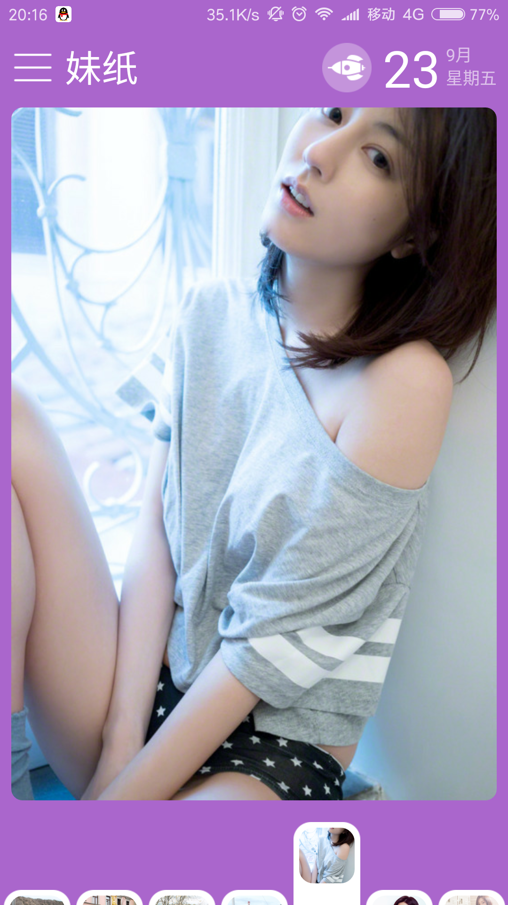
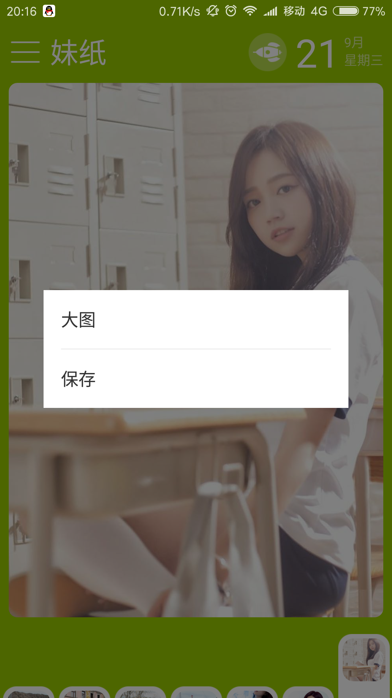
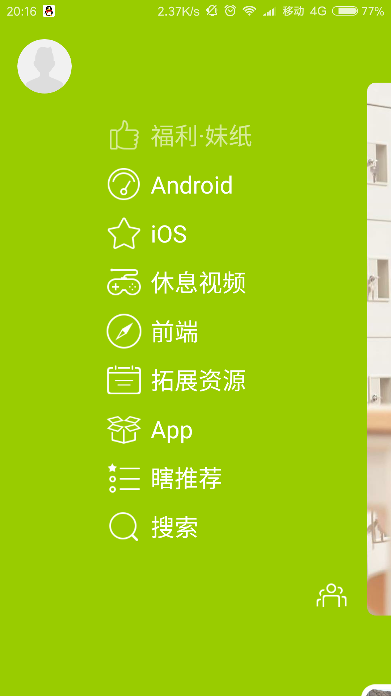

## 妹纸

**数据来自代码家的干货网站：http://gank.io**

**fir下载链接：http://fir.im/u94n**

仿照最美应用实现本应用(本人小菜鸟，第一次写开源项目，代码写的不是很好，请大家见谅)

v1.0.0
* 首页展示妹纸图片，下方用键盘样式展示小图片
* 长按图片可以选择查看大图和保存图片
* 侧滑打开面板
* 点击侧滑目录切换精选程序

用到的第三方库
1. retrofit
2. fresco
3. butterknife
4. ultra-ptr
5. leakcanary
